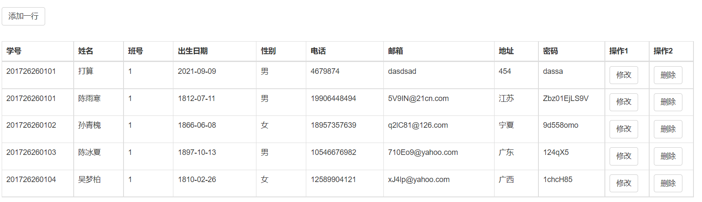
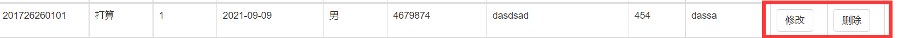
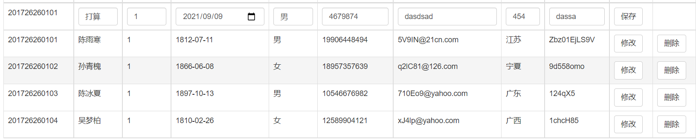

### 这个simple项目是什么
1.这个simple项目要求我们在页面加载的时候查询数据库,并将数据库中的内容按照一个表格的形式加载在页面上

2.这个表格中的每一行用户数据结尾处有两个操作,分别是修改和删除

3.当我们点击修改按钮时,我们将表格内的数据转换为一个输入框,并将修改变成保存(我在操作的时候同时将删除按钮删掉了)

4.点击保存(修改对应的)之后,在数据库中可以正常更新数据后,将数据变成不可更改状态
5.点击删除按钮之后,在正常删除对应的数据库中内容后,删除这一行的数据
6.在页面的顶部有一个插入一行按钮,点击这个按钮之后,会在表格的首部(为了防止表格数据内容过多,需要在页面底部添加数据带来的不方便)
添加一个可以输入文本的一行,和一个保存按钮

7.点击保存(插入一行对应的)之后,会将这一行数据变成不可更改状态,

## 注意
1.我在写问题的时候写了一下index.html的具体行数,之后代码不要进行更改,如发生更改,自己查找一下具体函数名

2.我在上传数据的时候将jdbc.properties中的数据库的密码删除掉了,下次自己下载运行的时候一定要自己加上

### 存在的问题
#### 前端引入问题
1.bootStrap引入问题:引入bootstrap的包无法实现效果(最终使用了cdn)

2.JavaScript的jutils工具类直接引入无用的问题(最终使用了cdn)

3.自己写的JavaScript代码在html界面中使用标签可以使用但是导出为js文件,重新导入出现了一些小问题,有些内容无法实现

#### 前端JavaScript代码问题
1.jQuery语法混写,由于第一次接触jQuery语法,导致在程序中会出现一些某些地方使用jQuery,
某些地方使用原生的js的问题,(如index.html 第213行),这是不是一个问题

2.js函数命名冲突问题,由于我将一个函数具体的操作抽成一个函数写出,于是出现了在一个不同的操作中有一个
类似的函数操作,但是我使用相同的函数名,导致调试的时候发生了预料之外的错误
(如 index.html 第150行,creatTr()和第327行createTrWithAdd()在第一遍写代码的时候发生了冲突,
都写成了creatTr)

3.代码重复率问题,在添加一行事件和修改事件的操作中,创建一行也就是creatTr()和createTrWithAdd()
虽然有不同,但是也有一些重复操作,应该抽成一个工具函数

4.工具函数在写的时候考虑情况较少,(index.html的60行creatRevice()和67行的creatReviceNotTd()在
抽成函数的时候欠考虑,导致调试出错,自己去补自己的坑)

5.由于是我自己写的代码,我规定了十一行,前九行是我要显示的数据,于是我直接使用了for循环0-9,这样会降低代码
的复用性(index.html153行),这是因为一个对象的遍历时我用了对象的长度(.length)来操作的时候发生了意外

6.在修改事件中,我将学生学号stuId变成了不可修改状态,是因为我发现update这个底层的sql语法需要一个where
name=?这样的标准,我将stuId修改之后我没有办法得到标准,于是我将其设定为不可更改状态,但这可能是我的建表问题

7.在插入一行和修改这个操作中,我们可以对数据进行操作,并且之后这个数据要返回到数据库中进行更改,但是我没有对这些数据
做一个限制,导致这个数据的数据只能依赖自觉性

### 后端问题
1.StudentUtils工具类问题问题,这个类位于utils包下,由于前端页面通过ajax传输过来的是一个用户的数据,而不是一个对象,
并且我是按照name:xxx的格式传过来的,因为目前我不知道更好的传输方式,因此我们需要将这个数据包装成一个对象,
于是我写了一个StudentUtils工具类,这个工具类有两个问题:

1.1我们应该使用反射的方式来写一个可以支持所有对象通用的方式,而不是使用这种只能支持一个对象的工具类,StudentUtils
代码复用性较差

1.2我们在写这个工具类的时候没有考虑到传输过来的是一个不合法数据怎么办,比如在gradeId这一栏需要传入一个long类型的数据
当我们传输了一个字母或者汉字的情况下会出现异常,但是我们并未对这个异常进行处理,并返回给前端页面一个结果,至少应该try catch一下

2.由于前端页面我们并未对这个数据做过多的规范,因此,我们在输入数据的时候更多依赖用户的自觉性,用户的自觉性输入数据的时候可能会导致两个问题,
首先是数据类型转换问题,第二个是他并未按照我们规范的数据格式来输入,比如电话应该是一个11位的,班级号应该是我们规范范围内的,我们需要在service
层做更多的业务,这属于我刚开始规划业务出错

2.1在写这个问题的时候,发现前端界面有一个错误,我们在前端界面并未告诉用户应该怎么输入数据,或者进行一个下拉按钮或者单选框等更便捷的方式来让用户输入,
依此来规范用户输入

3.我们在之后的调试中发现,stuUpdate()和stuAdd()并未按照我的想法执行我想要的结果

我们的设想:当我们传入一个不合法的数据导致程序出现异常的时候,这个函数应该可以返回一个false的操作,
这个时候我们会将这个结果返回给页面,页面会根据这个结果来执行是否更新domTree,来并提醒用户我们没有成功

但是实际上:我们出错了,当我们传入一个会让数据库产生异常的结果的时候,并没有返回一个false,并且页面的domTree
成功更新了页面
